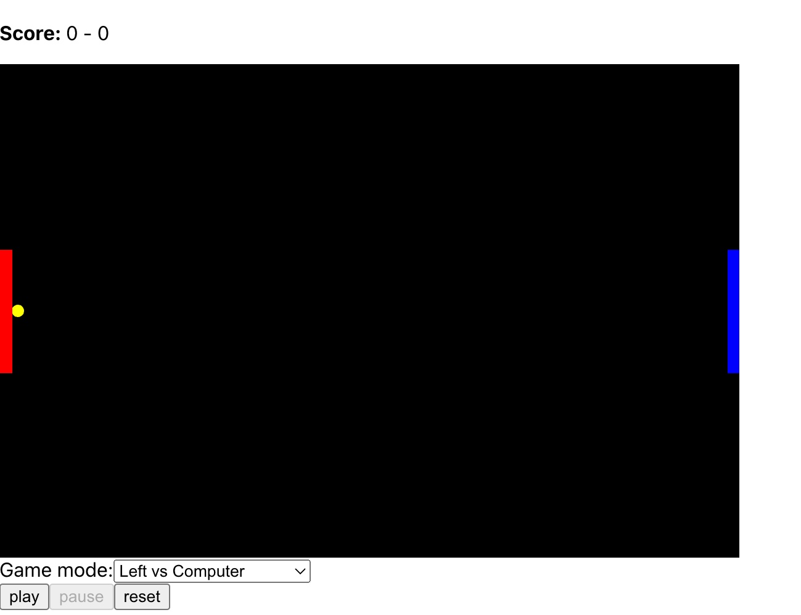

# Multiplayer Arkanoid Game

This project was bootstrapped with [Create React App](https://github.com/facebook/create-react-app) and Typescript.

The project uses [Fabric.js](http://fabricjs.com) to visualize the game.

## Gaming Instructions

The game has four modes:

- Computer vs Computer
- Computer vs Right
- Left vs Computer
- Left vs Right

The game has three player types:

- **Computer** player plays automatically.
- **Left** player controls the game with **A, W** keys from keyboard to move the racket up and **S, D** keys to move down.
- **Right** player controls the game with **ArrowLeft, ArrowUp** keys from keyboard to move the racket up and **ArrowRight, ArrowDown** keys to move down.

To start the game, you can either click on the **Play** button on the screen using your mouse, or press the **Space** bar on your keyboard. Once you have started the game, the ball will begin moving and you can start playing.

Remember! in the game the objective is to keep the ball in play by hitting it back and forth with your racket. If you miss the ball and it goes past your racket, the other player scores a point.

The game never ends!, once you had enough of playing you can check your score at the top of the screen and you can use **Reset** button to restart the game

## Project requirements

1. Latest Node Js to be installed
2. run `npm install`

## Available Scripts

In the project directory, you can run:

### `npm start`

Runs the app in the development mode.\
Open [http://localhost:3000](http://localhost:3000) to view it in the browser.

The page will reload if you make edits.\
You will also see any lint errors in the console.

### `npm test`

Launches the test runner in the interactive watch mode.\
See the section about [running tests](https://facebook.github.io/create-react-app/docs/running-tests) for more information.

### `npm run build`

Builds the app for production to the `build` folder.\
It correctly bundles React in production mode and optimizes the build for the best performance.

The build is minified and the filenames include the hashes.\
Your app is ready to be deployed!

## Test Coverage

For demo purpose only limited parts of the code has been covered with test. Those can be found at;

`src/utils/tests/isBallTouchingTheFenceSides.test.ts`
`src/utils/tests/isRacketTouchingTheBall.test.ts`
`src/utils/tests/whoWillStartFirst.test.ts`
`src/components/tests/ActionButtons.test.tsx`
